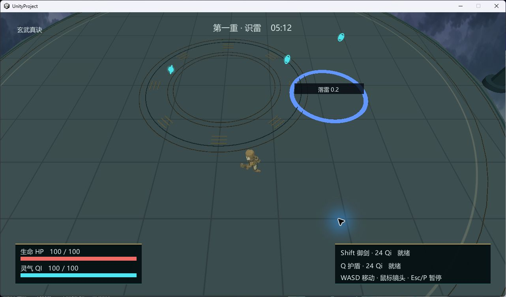
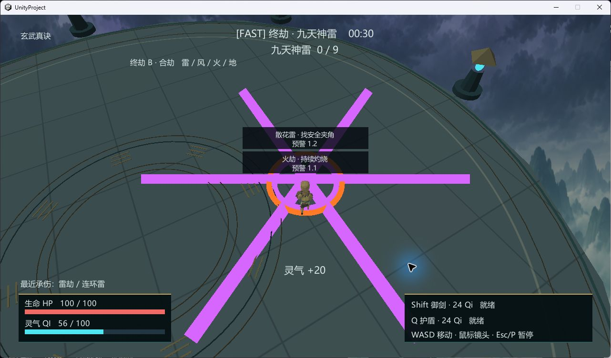

# 渡劫 · Ascension

**v1.0 独立Unity源码副本**：独立化验收已完成，原项目保留。打开、构建和依赖分类见 [IndependenceReport](Docs/IndependenceReport.md)。

一个小型修仙生存游戏策划 Portfolio Demo：在云海之上的渡劫台，观察天劫预警，规划路线，在御剑 Dash、护体 Shield 和灵气补给之间作选择，存活六分钟并渡过九天神雷。

目标平台：Windows x64；Unity 2022.3.62f3。单局正式时长 **360秒**，开发快速模式120秒，共用同一套规则。范围保持单人小型竞技场，没有NPC、剧情、装备、背包或开放世界系统。

## Gameplay Screenshot / GIF

<!-- Gameplay GIF 占位：真人试玩后补充15–30秒片段，展示转向、取气、Dash与护盾取舍。 -->

原T07精选截图见Screenshots/；本次独立化证据见Docs/Evidence/。GIF仍待录制，截图使用实际Build画面。

T07已完成。最终Release构建完成Formal360秒通关与Lose/Restart/Pause验证；完整报告见 Docs/Playtest.md。下载分发包：Builds/Windows/Ascension.exe。真人盲测仍pending。

## Core Loop

**看预警 → 选路线 → 决定步行/Dash/Shield → 冒险取气 → 为下一波预留资源 → 跨过四段难度 → 胜利或复盘重开。**

HP归零失败。正式六分钟存活胜利，Final最后有九道神雷；重开保留所选功法并重置本局状态。

## Controls

| 输入 | 行为 |
|---|---|
| WASD | 相机相对移动 |
| 鼠标 | 镜头方向 |
| Shift | 御剑 Dash，消耗Qi并进入冷却 |
| Q | Shield，消耗Qi，限时吸收伤害 |
| P / Esc | 暂停/继续 |
| 菜单按钮 | 开始、Restart、功法选择、360/120秒模式、音效开关 |

靠近青色灵气珠自动收集。HUD显示HP、Qi、阶段、剩余时间、技能费用/冷却/吸收余量、功法和当前天劫。预警同时提供形状、文字与倒计时，颜色不是唯一信息渠道。

## 天劫与可读性

普通雷、连环雷、追踪雷、预测雷与封路电场形成基础压力。蓝青/紫色预警与瞬时白色雷光区分“将发生”和“已发生”；追踪落点锁定后停止跟随。Final增加四种天劫：

| Final天劫 | 阅读与应对 |
|---|---|
| 风劫 | 青色箭头和方向流线，改变站位；逆向移动/Dash，Shield不能阻止风推 |
| 火劫 | 暖色预警、持续地面灼烧区与低矮火焰，离开并等待区域结束 |
| 地劫 | 金褐长条预警、裂纹和碎岩，横向离开路径 |
| 散花雷 | 紫色中心爆点和放射线，避开中心并选择安全夹角 |

预警范围直接来自规则模型。低亮度背景/阵纹与低矮效果让位于危险轮廓。Final控制主要攻击系统数量，保留逃生采样检查；有限测试不证明所有随机组合必然可解。

## 三种功法

| 功法 | Strength / Playstyle | Weakness |
|---|---|---|
| 青云剑诀 | Dash 14Qi / 2s，主动机动、及时改线 | Shield 36Qi，保命预算贵 |
| 玄武真诀 | Shield 24Qi / 60吸收 / 2s，守势取气 | Dash 24Qi / 2.5s，频繁撤离成本高 |
| 九霄心法 | 单颗Qi +25，主动补给与恢复 | Shield仅1.5s，需要精确施放 |

完整数字与历史修改见 [Balance](Docs/Balance.md)。九霄沿用原第三功法的资源取舍，内部稳定id为spirit，不是新增第四种功法。

## Risk vs Reward / Resource Management

Qi上限100，初始60，技能共用资源池。现在Dash离开落点，还是留气给下一次Shield，是局内反复出现的选择。部分补给位于中央、偏离当前路线或压力区域附近；最安全路线不保证持续补给。拾取与消耗均来自同一真实状态，界面没有独立假数值。

## Difficulty Curve

| 阶段 | Formal / Fast | 主要阅读任务 |
|---|---|---|
| 第一重：识雷 | 90 / 18秒 | 普通雷教学，理解预警与Qi |
| 第二重：连劫 | 120 / 22秒 | 连环雷、预测/封路开始影响补给路线 |
| 第三重：追命 | 92 / 22秒 | 追踪、预测、封路组合，资源预算与撤离 |
| Final：终劫 | 58 / 58秒 | 识劫→组合→九道神雷综合测试 |

Fast仅覆盖时长，不复制机制；直接启动exe默认Formal。快速模式用于缩短迭代，正式360秒必须单独验证。

## Playtest Iteration

最初持续绕圈能稳定生存，技能与Qi缺乏必要性。T06以预测落点和封路改变移动任务，调整补给位置；T06.5再加入四种Final天劫。固定绕圈在实测中第三阶段死亡，而读预警、改路线的策略可以通关。

T07聚焦视觉语言与反馈：完整角色/动画、云海雷云、石台阵纹、不同危险表现、事件音效与HUD。实际构建曾发现角色动画覆盖导入根节点变换和背景下缘空隙，逐项修复后复测。具体结果以 [Playtest](Docs/Playtest.md) 为准（旧版历史Evidence保留在安全备份，独立验证见IndependenceReport）。

**自动控制可精确读取预警，不能等同真人体验。** [真人盲测模板](Docs/BlindPlaytest.md) 已建立，真实结果仍pending；不虚构样本或通关率。[Portfolio Notes](Docs/PortfolioNotes.md) 提供面试讲述提纲。

## 独立源码项目：打开与构建

本目录可单独保存或移动，无需GameFactory-3A仓库。使用Unity Hub打开 **UnityProject/**，Unity版本 **2022.3.62f3**，安装Windows Build Support。首次启动等待官方UPM包与Library恢复。

打开 `Assets/Scenes/Ascension.unity`，点击Play开发；菜单 **Ascension > Build Windows Release** 构建到 `Builds/Windows/Ascension.exe`。也可用标准Build Settings，Windows x86_64、关闭Development Build。详见 [独立化报告](Docs/IndependenceReport.md)。无需Python、UnityClient或API Key。

目录包括UnityProject/Assets、Packages、ProjectSettings、Docs、Screenshots、THIRD_PARTY_LICENSES.md、.gitignore；Builds为可再生成产物，缓存目录不入库。发布时复制整个Windows构建目录，保留许可证。

Mechanic、Presentation、Balance、资产和场景沿用v1.0，未重设计。17个必要GameFactory Runtime C#文件以Apache-2.0随项目保存，完整清单见 [第三方许可](THIRD_PARTY_LICENSES.md)。这不要求原仓库同时存在。

## GameFactory-3A 来源与资产许可

基于 [OpenDCAI/GameFactory-3A](https://github.com/OpenDCAI/GameFactory-3A)，Copyright 2026 OpenDCAI，Apache-2.0；原框架未修改。保留来源与原许可证，不把框架能力声明为独立原创。

Quaternius角色、Kenney撞击音、OpenGameArt风/火为CC0；Jerimee的Thunder为CC BY 3.0，已署名并注明裁剪转换。术法提示音由项目原创合成，云海为AI生成。详细作品名、作者、链接、修改与许可证见 [Asset Sources](Docs/AssetSources.md)，Build随附同份说明及LICENSE-GameFactory-3A.txt。

## 当前边界

尚无真人盲测；三功法样本不能用于通关率排名。风格化修士使用通用Idle/Run，暂未制作专用施法/受击动作。背景远山不可探索。音频有真实游戏混音证据，主观听感仍需玩家在耳机/音箱上评价。非中文Windows需要检查中文字体回退。
