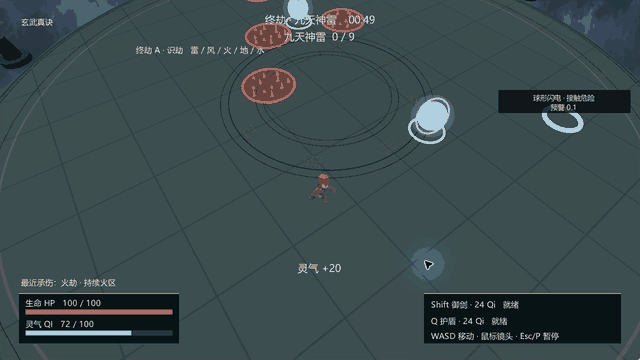

# 渡劫 · Ascension

**Unity 3D 修仙生存玩法 Demo｜Game Design Portfolio｜AI-assisted Development**

玩家在 **3 分钟**内观察天劫预警、规划移动路线，并在 Dash、Shield 与有限 Qi 资源之间持续做取舍。

这是一个个人主导、Codex 辅助实现的小型玩法作品集。重点看：**如何让“持续绕圈”不再解决所有危险，以及如何用补给和技能成本制造路线选择。**

## Quick Links

- [Gameplay 与当前画面](#gameplay)
- [Windows 下载](https://github.com/OWENgit66/Ascension-unity/releases/tag/v1.1)
- [Design Case Study：打破绕圈策略](Docs/PortfolioCaseStudy.md)
- [Game Design](Docs/GameDesign.md) · [Playtest](Docs/Playtest.md)
- [Source Code / Build Guide](Docs/BuildGuide.md) · [全部文档](Docs/README.md)

## Highlights

- **资源取舍：** Dash 与 Shield 共用 Qi，主动补给与保留技能预算形成风险收益选择。
- **策略迭代：** 用预测落点、前方封路和偏离当前路线的 Qi，针对固定方向绕圈；保留观察、转向的步行解法。
- **测试驱动：** 比较操作策略，分开记录模型检查、原生自动输入和开发者反馈，不把它们当作真人盲测。
- **AI 辅助交付：** 人定义问题、范围和验收；Codex 辅助实现、Debug、测试与文档，交付可打开的 Unity 源码。

## My Role

**我的贡献：** 玩法目标与范围定义、核心循环和系统取舍、需求拆解与优先级、Playtest 反馈、验收标准及迭代判断。

**AI / Codex 辅助：** C# 实现、Debug、自动输入测试、日志核验与文档整理；Unity MCP / Computer Use 用于工具操作与验证。不宣称所有代码由本人手写，也不估计没有依据的 AI 代码占比。

**复用内容：** GameFactory Runtime、第三方角色与音效；背景由 OpenAI imagegen 生成。详见 [来源与许可](THIRD_PARTY_LICENSES.md)。

## Gameplay

当前源码：**V1.1 R1 + 常规雷击去文字调整**。Formal 180 秒，Fast 90 秒；地面圈表达常规雷击范围和时机，阶段名称、HP/Qi、技能状态与特殊天劫提示继续保留。

下面是本轮当前 Windows Build 的 **20秒真实连续终劫片段**：玄武、正式模式、自动输入策略 E。约5fps采样，无音轨；未生成画面、修改规则或加速，不代表真人试玩。

[录制说明](Docs/GameplayCaptureChecklist.md) · [素材版本索引](Screenshots/README.md)。本地 Windows ZIP 已准备，GitHub Release 尚未上传；下载入口将在实际发布后添加。

## Core Loop

**观察预警 → 选择路线 → 步行 / Dash / Shield → 主动取气 → 为下一次危险留预算 → 存活胜利或复盘重开。**

HP 归零失败，存活至正式计时结束胜利。终劫包含九道神雷；Restart 重置本局状态并保留所选功法。

## Design Problem & Iteration

早期持续绕圈能避开大部分落点，使技能和资源可被忽略。迭代通过预测雷、封路及风险补给改变玩家的移动任务，而不是仅提高伤害或数量。

V1.1 Fast 的已留档自动测试中，固定绕圈约 **29.5 秒失败**，观察预警并组合技能的策略完成 **90 秒**。这不是玩家通关率，也不是严格单变量实验；精确观察的无技能策略在历史版本也曾通关。[查看完整案例与证据边界](Docs/PortfolioCaseStudy.md)

## Systems

| 系统 | 玩家需要作出的选择 |
| --- | --- |
| 普通 / 随机 / 连环 / 预测 / 追踪 / 封路雷 | 识别落点、锁定和连续危险，改变方向或路线 |
| 风、火、地、水、散花雷与球形闪电 | 判断方向、持续危险区、裂缝和安全夹角，避开移动障碍 |
| Qi + Dash / Shield | 现在撤离、承伤取气，还是保存下一次技能预算 |
| 青云 / 玄武 / 九霄 | 分别偏机动、防御和补给；每种都有费用或时机代价 |
| 四阶段节奏 | 教学 → 路线与资源压力 → 复合威胁 → 终劫综合测试 |

具体规则见 [GameDesign](Docs/GameDesign.md)，当前数值以 [Balance.json](UnityProject/Assets/Ascension/Mechanic/Resources/Balance.json)为准，[Balance](Docs/Balance.md)提供易读表格。

## Controls

| 输入 | 行为 |
| --- | --- |
| WASD / 鼠标 | 相机相对移动 / 镜头 |
| Shift / Q | Dash / Shield，消耗 Qi 并受冷却限制 |
| P 或 Esc | 暂停 / 继续 |
| 菜单按钮 | 开始、Restart、功法、Formal/Fast、音效 |

靠近青色 Qi 珠自动拾取。白紫色球形闪电是危险，不是补给。

## Build

使用 **Unity 2022.3.62f3** 和 Windows Build Support，Unity Hub 添加 `UnityProject/`，打开 `Assets/Scenes/Ascension.unity`。菜单 **Ascension > Build Windows Release** 输出 `Builds/Windows/Ascension.exe`。

无需完整 GameFactory 仓库；仍依赖随项目保留的 Runtime、Unity 和 UPM 包。源码与本地 Build 不需要 AI API Key。当前构建与发布状态见 [Release Checklist](Docs/ReleaseChecklist.md)，操作细节见 [Build Guide](Docs/BuildGuide.md)。

## Testing

- 本轮 Windows x64 构建 0 错误 / 0 警告；180 秒正式局完成，Launch / 技能 / Pause / Restart / Win / Lose 基础流程验证通过。历史测试结果按版本单独归档。
- 模型覆盖检查与自动输入主要用于核验规则、预警时序和流程完整性，不能代表真人理解、乐趣或总体平衡。
- 已完成首轮小规模真人盲测，共 3 名首次玩家：
  - Tester A 在体验结束后反馈“这就没了吗？”，提示当前可能存在结束感或内容完整度不足的问题；
  - Tester B 认为“画面太粗糙了，音乐也不咋地”，说明当前视听表现仍是主要完成度短板；
  - Tester C 认为“操作还挺流畅的”，基础移动与输入暂未暴露明显问题。
- 本轮真人反馈主要用于发现问题，不用于推导通关率、满意度或统计结论。后续优先验证视觉完成度、音乐表现、结算反馈、玩法理解与死因可读性。

[当前验证矩阵](Docs/Playtest.md) · [真人盲测记录](Docs/BlindPlaytest.md) · [ROADMAP](ROADMAP.md)

## Limitations

这是一个小型单人生存玩法 Demo，当前范围聚焦在预警阅读、路线选择与 Qi / Dash / Shield 资源取舍。

当前仍存在以下限制：

- 真人盲测样本仅 3 人，且首轮访谈并未完全结构化，因此当前反馈更适合作为形成性问题发现，而不是普遍用户结论。
- 视觉表现和音乐完成度仍有明显提升空间；当前角色、特效、UI 与场景风格尚未完全统一。
- 游戏结束后的反馈和成果感仍需继续优化，当前尚未证明 3 分钟时长或现有结算方式是最佳方案。
- 项目没有 NPC、剧情、装备、背包、开放世界或完整长期成长系统；它是作品集玩法原型，不是完整商业游戏。
- 自动策略可以读取比普通玩家更精确的状态，因此自动通关或失败结果不能直接代表真人体验。
- 三种功法的差异、资源压力与部分危险组合仍需更多真人与多种子测试验证。
- 角色当前使用通用 Idle / Run 动画，未制作完整专用施法、受击与高级表现动画。

## Credits

[GameFactory-3A](https://github.com/OpenDCAI/GameFactory-3A) Runtime 源码按 Apache-2.0 保留；Quaternius 角色及部分音效为 CC0，Jerimee 的 Thunder 为 CC BY 3.0，已保留署名和修改说明。云海背景为 AI 生成，非手绘原创。项目自有代码未新增整体开源授权，第三方许可不自动覆盖全仓库。

[THIRD_PARTY_LICENSES](THIRD_PARTY_LICENSES.md) · [AssetSources](Docs/AssetSources.md) · [License files](Docs/Licenses/)
